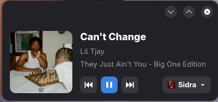

# MPRIS MiniPlayer

MPRIS MiniPlayer is a small GTK4/libadwaita mini player for Linux media players that expose the MPRIS interface on the session D-Bus.

It is not tied to a specific player. It is intended to work with Sidra, VLC, Spotify, Strawberry, Rhythmbox, Elisa, browsers exposing media sessions, Mopidy, spotifyd, mpv with an MPRIS plugin, and similar clients.

## Screenshot



## Features

- Detects MPRIS players on the session bus
- Selects the first available player automatically
- Shows track title, artist, album, and album art
- Provides previous, play/pause, and next controls
- Updates the UI when player metadata changes

## Build

Install the typical development dependencies on Debian or Ubuntu:

```bash
sudo apt install meson ninja-build valac libgtk-4-dev libadwaita-1-dev gettext desktop-file-utils appstream-util
```

Build and run:

```bash
meson setup build
meson compile -C build
./build/src/mpris-miniplayer
```

Install locally:

```bash
sudo meson install -C build
```

## License

MPRIS MiniPlayer is licensed under the GNU General Public License v3.0 or later.
