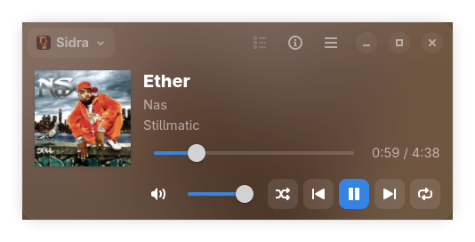

# MPRIS MiniPlayer

[](<>)
[](<>)
[](<>)
[](<>)


MPRIS MiniPlayer is a small GTK4/libadwaita mini player for Linux media players that expose the MPRIS interface on the session D-Bus.

It is not tied to a specific player. It is intended to work with [Sidra](https://github.com/wimpysworld/sidra), [Slipmat](https://github.com/SoftARV/Slipmat), Cider, VLC, Spotify, Strawberry, Rhythmbox, Elisa, browsers exposing media sessions, Mopidy, spotifyd, [mpv with an MPRIS plugin](https://github.com/mpv-player/mpv), and similar clients.

## Screenshot



## Install

Download the latest release asset from the [GitHub releases page](https://github.com/ChrisLauinger77/mpris-miniplayer/releases/latest).

For Flatpak, install the bundle with:

```bash
flatpak install --user ./MPRIS-MiniPlayer-<version>-x86_64.flatpak
```

For Debian or Ubuntu on amd64, install the Debian package with:

```bash
sudo apt install ./mpris-miniplayer_<version>_amd64.deb
```

For Fedora on x86_64, install the RPM package with:

```bash
sudo dnf install ./mpris-miniplayer-<version>.x86_64.rpm
```

Run it from your application launcher, or from a terminal.

For Flatpak:

```bash
flatpak run io.github.ChrisLauinger.MprisMiniPlayer
```

For the Debian package:

```bash
mpris-miniplayer
```

MPRIS MiniPlayer needs at least one running MPRIS-compatible media player to show playback controls.
When it starts without a player, it can stay hidden in the background and show the window automatically later.

## Features

- Detects MPRIS players on the session bus
- Selects the first available player automatically
- Shows track title, artist, album, and album art, with a fallback player icon when artwork is unavailable
- Provides previous, play/pause, and next controls
- Supports synchronized shuffle and repeat modes when exposed by the player
- Shows an adaptive, scrollable queue for players with MPRIS TrackList support
- Shows playback progress and time
- Lets you seek when the selected player supports it
- Lets you adjust volume when the selected player exposes MPRIS volume control
- Lets you choose between available players
- Provides a compact mode for a smaller window layout
- Updates the UI when player metadata changes
- Can keep running in the background when no player is available
- Can show and hide the window automatically as players appear or disappear
- Can show a status indicator with current track information, media controls, and volume presets when the desktop supports it
- Adjusts volume by scrolling over the status indicator, with temporary icon feedback and a 100% upper limit
- Provides status indicator actions for showing or hiding the window, compact mode, preferences, about, and quit
- Provides preferences for compact mode, background notifications, automatic visibility, status indicators, and start on login
- Shows a status indicator link when a newer stable release is available
- Hides the window on close; use Quit to stop the app

## Build from Source

Install the typical development dependencies on Debian or Ubuntu:

```bash
sudo apt install meson ninja-build valac libgtk-4-dev libadwaita-1-dev libsoup-3.0-dev gettext desktop-file-utils appstream
```

Build and run:

```bash
meson setup build
meson compile -C build
meson devenv -C build ./src/mpris-miniplayer
```

`meson devenv` runs the build-tree binary with the generated GSettings
schemas available, so preferences work before installing the app.

Install locally:

```bash
sudo meson install -C build
```

Uninstall the local build:

```bash
sudo ninja -C build uninstall
```

## Maintainer Release

Pushing a version tag builds a Flatpak bundle, an amd64 Debian package, an x86_64 RPM package, and creates a GitHub release:

```bash
git tag v1.4.2
git push origin v1.4.2
```

The release workflow attaches `MPRIS-MiniPlayer-<tag>-x86_64.flatpak`, `mpris-miniplayer_<tag>_amd64.deb`, and `mpris-miniplayer-<tag>.x86_64.rpm` to the generated release.

## License

MPRIS MiniPlayer is licensed under the GNU General Public License v3.0 or later.

## Reliability checks

Run the complete test suite after building:

```bash
meson test -C build --print-errorlogs
python3 tools/check-release.py
```

Tests require `dbus-run-session` (the `dbus-daemon` package) and Python 3 in
addition to the build dependencies. D-Bus integration tests start an isolated
bus and do not control desktop media players. Restricted environments that
cannot create local sockets can run the unit tests with
`meson test -C build --no-suite dbus --print-errorlogs`; the complete suite still
needs to pass in CI.

Pull requests and releases run validation. Release builds reject inconsistent
Meson, AppStream, Debian, RPM, manpage, and Git tag versions. See
[the reliability report](docs/reliability-report.md) for changes and remaining
platform validation.
